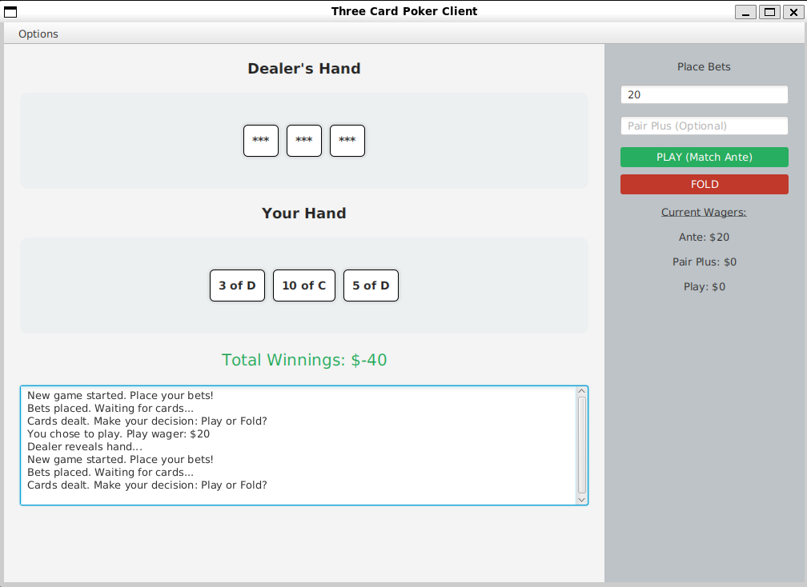
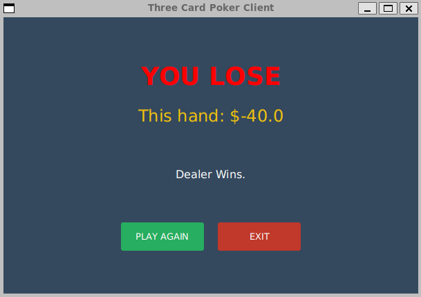

# Three-Card Poker: Networked Client-Server Application

## 📌 Overview
This project is a fully networked, multiplayer Three-Card Poker game built using **Java**. It utilizes a robust **Client-Server architecture** communicating via **Java Sockets**, allowing multiple client applications to connect to a central server and play simultaneously.

The application is split into two distinct modules (`ThreeClient` and `ThreeServer`) and features a graphical user interface built with **JavaFX**.

### 🃏 How the Game Works
In Three-Card Poker, players evaluate their hands against the dealer (managed by the server). Each player receives three cards, and hands are ranked using standard poker hierarchies adapted for three cards (e.g., Straight Flush, Three of a Kind, Straight, Flush, Pair, High Card). Players place Ante and Pair Plus wagers, and the server automatically calculates winnings and losses based on the hand comparisons.

## 📸 Screenshots

<details>
<summary><b>Click to view the application walkthrough (4 images)</b></summary>
<div align="left">
  
  <h3>Initial Connection</h3>
  <p>The client entry point where players specify the server's IP address and port.</p>
  

  <h3>Server Dashboard & Live Logs</h3>
  <p>The multithreaded server interface showcasing real-time event logging.</p>
  

  <h3>Active Gameplay</h3>
  <p>The main game interface during a live hand with revealed cards.</p>
  

  <h3>Hand Evaluation Results</h3>
  <p>The final result state showing the bankroll update.</p>
  

</div>
</details>

## 🚀 Technical Stack
* **Language:** Java
* **Framework:** JavaFX (UI layout via FXML, styling via CSS)
* **Networking:** Java Sockets (TCP/IP), Object Serialization
* **Build Tool:** Maven
* **Testing:** JUnit 5 (Comprehensive testing of game logic and hand evaluation)

## ✨ Key Features
* **Client-Server Architecture:** Strict separation of concerns. The server handles game state, card distribution, and win/loss logic, while the client is strictly responsible for rendering the UI and capturing user input.
* **Concurrency & Multithreading:** The server utilizes multithreading to actively listen for new connections while seamlessly managing the game state of currently connected clients without blocking.
* **Data Serialization:** Network communication is handled by serializing and transmitting a custom `PokerInfo` object back and forth between the client and server streams.
* **UI/Logic Separation:** UI layouts are cleanly abstracted into `.fxml` files and styled with `.css`, ensuring the Java controllers only handle application logic.

## 📁 Project Structure
The repository is divided into two separate Maven projects:
* **/ThreeServer:** Contains the core game engine, the multithreaded server logic, deck management, and the `ThreeCardLogic` evaluation system.
* **/ThreeClient:** Contains the JavaFX application, FXML views (`welcome.fxml`, `game.fxml`, `winLose.fxml`), and client-side socket connection logic.
* **/shared:** Both modules utilize a `PokerInfo.java` and `Card.java` class. **Important:** These classes *must* remain completely identical on both the client and server sides to ensure Java Object Serialization works correctly across the network boundary.

## 🛠️ How to Run
Because this is a networked application, you must run the Server and the Client(s) in separate instances.

**Prerequisites:**
* Java Development Kit (JDK) installed.
* Apache Maven installed.

**1. Start the Server:**
1. Open a terminal and navigate to the `ThreeServer` directory.
2. Compile and run the server using Maven:
   ```bash
   mvn clean compile exec:java
3. Enter the server's IP address (e.g., 127.0.0.1 for local) and the port number you configured on the server, then click connect.
4. Optional: Repeat the client steps in additional terminal windows to simulate multiple players connecting to the same server.
